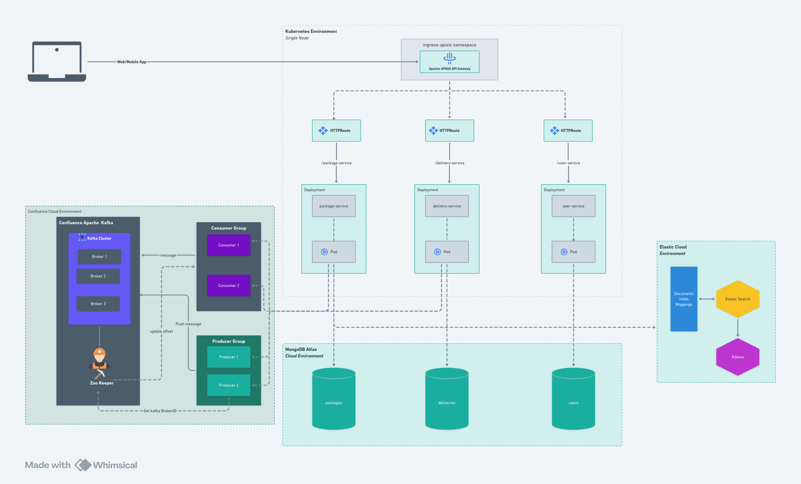

# Kubernetes, Docker, AWS, Compliance-Library(Kafka,Persistence,Authentication and Authorization,Logging,Elastic search,Validation Link:https://www.npmjs.com/package/compliance-library), Microservices

